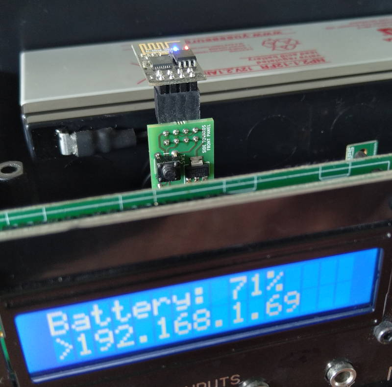
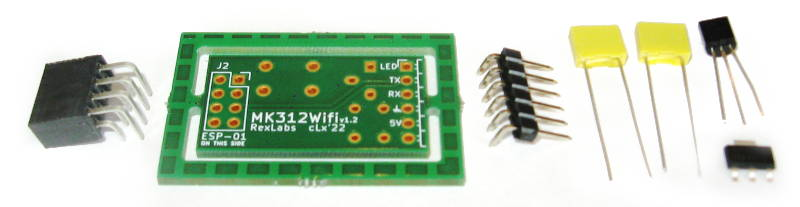
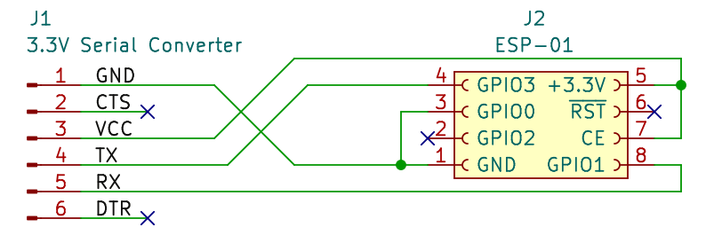
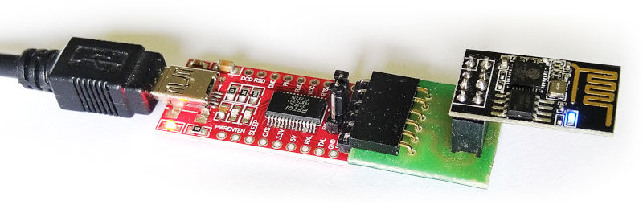
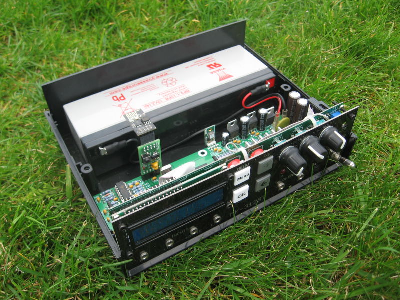

# MK312 Wifi Bridge

This Project is a replacement for the bluetooth module used on the MK312BT and is based on the ESP8266-01S. This was created at first because the bluetooth interface could not be accessed in a convenient way on a VR headset, but also because of a general lack of reliability of the link. As usual no guarantees can be given, and also if you use this to injure yourself, no responsibility can be taken. This project is a collaboration between Rangarig and cLx.

## Contents
| Directory      | Contains
|----------------|-------------------------------------------------------------------------|
| MK312Wifi      | Firmware that should be used to flash the ESP (ino source and bin file) |
| MK312-wifi-pcb | Schematics and board KiCad files needed to produce the PCB              |
| DotNetClient   | Example implementation in .net (visual studio code)                     |

## General
This WiFi interface is pin to pin compatible to the bluetooth interface, and designed to be an easier way to make custom implementations of the communication with the MK312 powerbox.
Included is an example C# implementation, that can be used in a unity project. Most existing implementations should be really easy to adapt to this WiFi version.

To make things configuration free the firmware replies to specific broadcast UDP packet, so the software can automatically determine the IP address of the interface.
A single TCP port is used for the actual communication with the device. At any time, only one client can be connected.

You can see a connection by the radio LED lighting up and then flashing as communication is in progress.

## Hardware
Feel free to use the provided PCB layout for the connections. In case you want to build your own:
Keep in mind that the VCC from the box is 5 volts, so you will need to convert that to 3.3V or you will burn your ESP module.
The signal level from the box is already at 3.3 volts (as there is already a resistor bridge) so we don't really need to do anything else.


Connections are:

| ESP Pin Name | In-between            | MK312 |
|--------------|-----------------------|-------|
| GND          |                       | GND   |
| VCC          | 3.3V regulator        | VCC   |
| CHIP_EN      |                       |       |
| GPIO0        |                       | TX    |
| GPIO2        |                       | RX    |
| GPIO1        | NPN transistor        | STATE |
| GPIO3        | AP mode switch to GND |       |

The hardware serial port outputs a lot of garbage in the bootloader, that can confuse the MK312, so a software implementation is used that might make the used pin seem a bit odd.

## Firmware
Upon first powerup, the device will go into an Access Point mode (the MK312 display will show "WifiAP"), and you can connect to with your cellphone to configure the connection to your local wifi network. Once a WiFi connection is established, the device will display the IP obtained IP address on the LCD display. In consequent powerups the device will reconnect to the same wifi network. If you wish to change the network to use, press the config wifi button. The WifiAP mode is also automatically called if the configured network is not found after power up.



The firmware will negotiate a key with the box, and then use that key continuously internally.
You can send a UDP broadcast to port 8842 containing the string "MK312-ICQ" to have the device return its IP address.
You can then create a TCP connection to that IP Address on port 8843.

### Normal encrypted mode:
you can then proceed just like you would with a serial connection, and send the 0x00 to recieve 0x07 and then do the key negotation
### Unencrypted mode:
if you wish to skip encryption, instead of the normal key negotiation command you need to send `0x2f4242`. This is an invalid checksum, but the command will be recognized by the device.
It will reply with `0x69`. From there on you do not need to use any encryption.

From here on communication is no different from the serial communication:
https://docs.buttplug.io/docs/stpihkal/protocols/erostek-et312b/

Serial software implementations should not notice the difference. Once connection is lost, the software should be able to reestablish the connection normaly.

## Building

Please note that not all components need to be fitted to the front of the device. There are hints on PCB to what goes where.



|Qty| Component                 |
|---|---------------------------|
| 1 | ESP8266-01S module        |
| 1 | AMS1117-3.3 regulator     |
| 2 | 100nF (104) capacitors    |
| 1 | 2N2222 transistor         |
| 1 | Tactile switch 6x6 mm     |
| 1 | 5 pins pin header, angled |
| 1 | 2x4 pins socket, angled   |


## Flashing the firmware

Please keep in mind that the ESP8266-01 runs on 3.3 volts. So your serial adapter should be set in **3.3 VOLTS MODE** or the ESP will die.
The ESP8266-01 can be programmed connected like this:





|Row 1|Pins|Row 2|
|-----|----|-----|
|  TX |o  o| GND |
|  EN |o  o|     |
| RST |o  o| PRG |
|3.3V |o  o| RX  |

(ESP module top view, row 1 is closer to its board edge)

To put the ESP into programming mode, keep IO0/PRG connected to ground. You can make RST touch GND briefly to force a reset (it is possible to use the RTS output of the USB serial adapter to do this automatically, but most of the time, this is not needed).

Webserver feature need data to be uploaded on the ESP module. You can add [this tool](https://github.com/earlephilhower/arduino-esp8266littlefs-plugin/releases) in the Arduino interface.

Once the ESP is programmed and attached to the board you can put it into the MK312 bluetooth slot, please make sure its facing the right way.

Once the ESP Powers up, it will immediately try to negotiate with the MK312. If that fails, it will show an error message on the message LED:

| Number of blinks | Cause                                |
|------------------|--------------------------------------|
| 1                | Invalid checksum                     |
| 2                | Handshake failed at step 1           |
| 3                | Handshake failed at step 2           |
| 4                | Handshake failed at step 3           |
| 5                | Unexpected reply from device         |
| 10               | Unexpected reply from poke operation |
| 11               | Unexpected reply from peek operation |

Once negotiations are successful, the WIFI module will power up. On first startup it will go into AP mode.
Look for a network called 'MK312CONFIG-AP' and connect to it with your cellpone. Then set up the WIFI Parameters.
The module will then connect to WIFI, and display its IP adress on the MK312's display.
At this point it is ready to be connected to. The network settings are saved to be used automatically the next time the box is switched on.

### Flashing the provided bin files:
```
$ esptool --chip esp8266 --port /dev/ttyUSB0 --baud 115200 write_flash 0x0 MK312Wifi.ino.bin
esptool.py v3.0
Serial port /dev/ttyUSB0
Connecting....
Chip is ESP8266EX
Features: WiFi
Crystal is 26MHz
Uploading stub...
Running stub...
Stub running...
Configuring flash size...
Compressed 363184 bytes to 258186...
Wrote 363184 bytes (258186 compressed) at 0x00000000 in 22.9 seconds (effective 126.8 kbit/s)...
Hash of data verified.
```

Then the same for the webserver files, the difference is the destination address:

```
$ esptool --chip esp8266 --port /dev/ttyUSB0 --baud 115200 write_flash 0xEB000 MK312Wifi.mklittlefs.bin
```

(If you have installed the Arduino software, esptool can also be called with `python3 ~/.arduino15/packages/esp8266/hardware/esp8266/3.1.2/tools/esptool/esptool.py`)

### Compiling and flashing from the source code with the Arduino software:
Setting up the Arduino software: (it might work with newer versions, these are just the versions we developed things on)
Install Arudino: https://www.arduino.cc/en/software (Version 1.8.19)
Install Boardmanager: http://arduino.esp8266.com/stable/package_esp8266com_index.json (Version 3.0.2) [Generic ESP8266 module]
(under 'file/preferences' add the path to "Additional Boards Manager URLs:", then close the dialog with okay, and select the board on "Tools / boardmanager")
Install WifiManager: https://github.com/tzapu/WifiManager (version 2.0.5-beta)
(Download the file, and add it to your libraries with Sketch/Include Library/Add. Zip library)

Then close the application, reopen it and load the ino file.

Once all is setup correctly, you should be able to compile the accompanied .ino and flash it to the device.

## Usage

### Using software implemented for it:
There is no configuration necessary. The software will determine the IP via UDP broadcast and then connect to it.

List of implementations follows:
  - See the example C# application
  - https://github.com/clxjaguar/mk312-gui (PyQt GUI supporting cable link and unencrypted or legacy network links)

### Using legacy cable or bluetooth software:
There is software able to make a virtual serial port, which any software using serial port use.
#### Linux:
In linux you can use socat to establish a connection to the device, and offer a comport for the legacy software to connect to.
The syntax is as follows (replace [] with the corresponding values):

`socat -v pty,link=/home/[user]/tcptty0,raw tcp:[IP Address shown on display]:8843`

Then, you can then connect to `/home/[user]/tcptty0` from your software.

#### Windows:
VSPE (Virtual Serial Port Emulator) is known to work pretty well.
https://www.youtube.com/watch?v=7g6v_m208LQ

## Bonus picture of a MK312 with the v1.1 WiFi bridge interface in the grass


